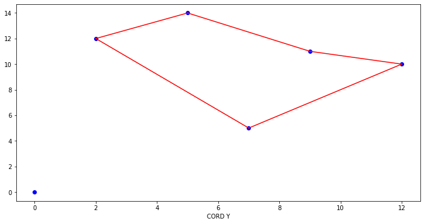
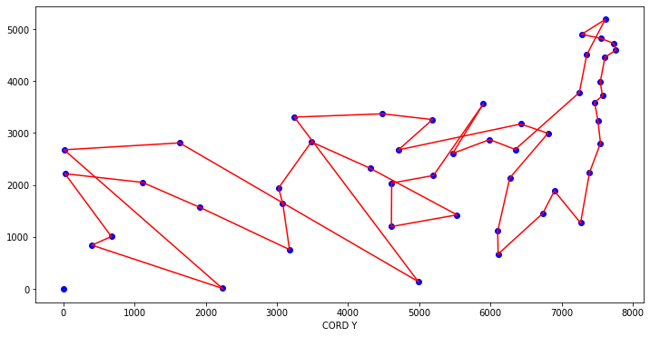
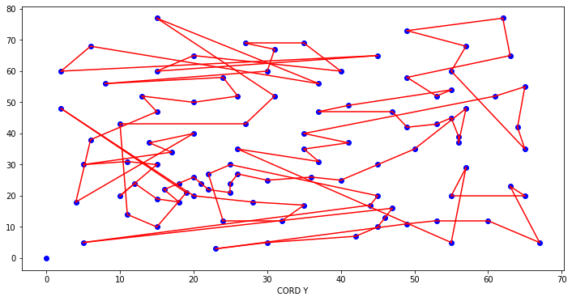

# Nearest-insertion
Algoritmo que resuelve TSP con Nearest insertion (Algoritmo de inserción mas cercana). 5,48 y 101 nodos.

# Descripción del algoritmo. 
 
Consiste en comenzar construyendo ciclos que visiten únicamente un subtour, formado por 2
        nodos (Uno inicial y el nodo más cercano al inicial), para posteriormente extenderlos insertando 
        los vértices restantes.

        
 <ol>

 <li value="1">Escoge un nodo arbitrario i como nodo de inicio.</li>
 <li>Encuentra el nodo más cercano a i. El nodo j para el cual la distancia cij es la menor. Forma el subtour T=i-j-i.</li>
 <li>Encuentra un nodo k que no esté en el subtour T que esté lo más cercano posible de cualquier nodo del subtour T.</li>
 <li>Encuentra un arco [i,j] del subtour T para el cual la inserción de k da el menor incremento en longitud, es decir, k para la cual ∆𝑓 = 𝑐𝑖𝑘 + 𝑐𝑘𝑗 − 𝑐𝑖𝑗 sea el mínimo.</li>
 <li> Modifique el subtour T mediante la inserción de k entre i y j. </li>
 <li>Vaya al paso 3 hasta que se haya formado un tour TSP.</li>
        
</ol>

  Ruta para 5 nodos:

  

Ruta para 48 nodos:

  

Ruta para 101 nodos:

  

